# 02 - Data and Control Flow: Llama Mask System

## 입력 → 변환 → 출력 경로

### 단계별 데이터 변환 표

| 단계 | 함수 | 입력 데이터 | 변환 로직 | 출력 데이터 | 메모리 |
|------|------|------------|----------|------------|--------|
| 1 | `LlamaModel.forward()` | `input_ids` [B, S] | `embed_tokens()` | `inputs_embeds` [B, S, D] | S×D×4 bytes |
| 2 | `create_causal_mask()` | `inputs_embeds`, `attention_mask` [B, S] | `_preprocess_mask_arguments()` | `q_length`, `kv_length`, offsets | O(1) |
| 3 | `mask_interface()` | mask function, lengths | broadcasting 또는 vmap | `causal_mask` [B, 1, Q, KV] | B×Q×KV bytes |
| 4 | `LlamaAttention.forward()` | `hidden_states` [B, S, D], `causal_mask` | Q/K/V proj + RoPE | `query`, `key`, `value` [B, H, S, Dh] | 3×B×H×S×Dh×2 |
| 5 | `eager_attention_forward()` | `query`, `key`, `value`, `causal_mask` | `Q@K^T + mask → softmax → @V` | `attn_output` [B, S, D] | B×S×D×4 |

**범례**: B=batch_size, S=seq_len, D=hidden_dim, H=num_heads, Dh=head_dim, Q=query_length, KV=kv_length

## Mermaid SequenceDiagram - 전체 마스크 흐름

```mermaid
sequenceDiagram
    participant User
    participant LlamaLM as LlamaForCausalLM
    participant LlamaModel
    participant MaskUtils as masking_utils
    participant MaskInterface
    participant Layer as LlamaDecoderLayer
    participant Attn as LlamaAttention
    participant Cache as DynamicCache
    
    User->>LlamaLM: generate(input_ids, attention_mask_2D)
    Note over User,LlamaLM: input_ids: [B, S]<br/>attention_mask: [B, S] (2D padding mask)
    
    LlamaLM->>LlamaModel: forward(input_ids, attention_mask)
    
    Note over LlamaModel: Step 1: 임베딩 변환
    LlamaModel->>LlamaModel: inputs_embeds = embed_tokens(input_ids)
    Note over LlamaModel: inputs_embeds: [B, S, D]
    
    Note over LlamaModel: Step 2: 캐시 초기화
    LlamaModel->>Cache: DynamicCache(config)
    Note over Cache: past_key_values = empty cache
    
    Note over LlamaModel: Step 3: 위치 ID 계산
    LlamaModel->>LlamaModel: position_ids = [0,1,...,S-1].unsqueeze(0)
    Note over LlamaModel: position_ids: [1, S]
    
    Note over LlamaModel: Step 4: ⭐ Causal Mask 생성
    LlamaModel->>MaskUtils: create_causal_mask(config, inputs_embeds, attention_mask, past_key_values, position_ids)
    
    Note over MaskUtils: 4-1. 전처리
    MaskUtils->>MaskUtils: _preprocess_mask_arguments()
    Note over MaskUtils: - attention_mask가 2D인지 확인<br/>- past_key_values가 None → q_length=S, kv_length=S<br/>- packed sequence 감지 (position_ids 분석)
    
    Note over MaskUtils: 4-2. Attention 구현 확인
    MaskUtils->>MaskUtils: mask_interface = ALL_MASK_ATTENTION_FUNCTIONS[config._attn_implementation]
    Note over MaskUtils: config._attn_implementation = "sdpa" or "eager" or "flash_attention_2"
    
    alt _attn_implementation == "sdpa"
        MaskUtils->>MaskInterface: sdpa_mask(batch_size, q_length, kv_length, mask_function=causal_mask_function, attention_mask, ...)
        
        Note over MaskInterface: 마스크 스킵 조건 검사
        MaskInterface->>MaskInterface: _ignore_causal_mask_sdpa(padding_mask, q_length, kv_length)
        
        alt 스킵 가능 (no padding, q_length==1 or q_length==kv_length)
            MaskInterface-->>MaskUtils: return None
            Note over MaskUtils: SDPA의 is_causal=True 사용 (Flash Attention 가능)
        else 마스크 생성 필요
            Note over MaskInterface: Non-vmap 방식 (기본)
            MaskInterface->>MaskInterface: batch_arange = [0,1,...,B-1]
            MaskInterface->>MaskInterface: q_arange = [0,1,...,Q-1] + q_offset
            MaskInterface->>MaskInterface: kv_arange = [0,1,...,KV-1] + kv_offset
            
            Note over MaskInterface: Broadcasting으로 확장
            MaskInterface->>MaskInterface: q_arange → [1, 1, Q, 1]
            MaskInterface->>MaskInterface: kv_arange → [1, 1, 1, KV]
            
            Note over MaskInterface: causal_mask_function 적용
            MaskInterface->>MaskInterface: attention_mask = (kv_arange <= q_arange)
            Note over MaskInterface: 결과: [B, 1, Q, KV] boolean tensor
            
            alt padding mask 있음
                MaskInterface->>MaskInterface: attention_mask = attention_mask & padding_mask
            end
            
            MaskInterface-->>MaskUtils: return [B, 1, Q, KV] boolean mask
        end
        
    else _attn_implementation == "eager"
        MaskUtils->>MaskInterface: eager_mask(batch_size, q_length, kv_length, ...)
        
        Note over MaskInterface: SDPA mask 생성 후 0/-inf 변환
        MaskInterface->>MaskInterface: bool_mask = sdpa_mask(...)
        MaskInterface->>MaskInterface: min_dtype = torch.finfo(dtype).min
        MaskInterface->>MaskInterface: float_mask = torch.where(bool_mask, 0.0, min_dtype)
        
        MaskInterface-->>MaskUtils: return [B, 1, Q, KV] float mask (0 or -inf)
        
    else _attn_implementation == "flash_attention_2"
        MaskUtils->>MaskInterface: flash_attention_mask(batch_size, q_length, kv_length, attention_mask)
        
        Note over MaskInterface: Flash Attention은 un-padded 입력
        MaskInterface->>MaskInterface: if attention_mask.all(): return None
        MaskInterface->>MaskInterface: else: return attention_mask[:, -kv_length:] (2D)
        
        MaskInterface-->>MaskUtils: return None or 2D mask
    end
    
    MaskUtils-->>LlamaModel: causal_mask (4D tensor or None)
    Note over LlamaModel: causal_mask: [B, 1, S, S] or None
    
    Note over LlamaModel: Step 5: RoPE 위치 인코딩
    LlamaModel->>LlamaModel: cos, sin = rotary_emb(inputs_embeds, position_ids)
    Note over LlamaModel: cos, sin: [B, S, Dh]
    
    Note over LlamaModel: Step 6: Decoder 레이어 순회
    loop for each decoder_layer in self.layers (예: 32개 레이어)
        LlamaModel->>Layer: forward(hidden_states, attention_mask=causal_mask, position_embeddings=(cos, sin))
        
        Note over Layer: Layer 구조: Attention + MLP (residual connections)
        Layer->>Layer: residual = hidden_states
        Layer->>Layer: hidden_states = input_layernorm(hidden_states)
        
        Note over Layer: Self-Attention
        Layer->>Attn: self_attn(hidden_states, attention_mask=causal_mask, position_embeddings, past_key_values)
        
        Note over Attn: Q, K, V 프로젝션
        Attn->>Attn: query = q_proj(hidden_states) → [B, H, S, Dh]
        Attn->>Attn: key = k_proj(hidden_states) → [B, H_KV, S, Dh]
        Attn->>Attn: value = v_proj(hidden_states) → [B, H_KV, S, Dh]
        
        Note over Attn: RoPE 적용
        Attn->>Attn: query, key = apply_rotary_pos_emb(query, key, cos, sin)
        Note over Attn: query * cos + rotate_half(query) * sin
        
        Note over Attn: 캐시 업데이트 (generation 시)
        alt past_key_values is not None
            Attn->>Cache: cache.update(key, value, layer_idx)
            Cache-->>Attn: updated_key, updated_value
            Note over Attn: key, value = past + current
        end
        
        Note over Attn: Attention 계산
        Attn->>Attn: attention_interface = ALL_ATTENTION_FUNCTIONS[config._attn_implementation]
        
        alt eager attention
            Attn->>Attn: attn_weights = query @ key^T * scaling
            Note over Attn: attn_weights: [B, H, Q, KV]
            
            Note over Attn: ⭐ 마스크 적용 (핵심)
            Attn->>Attn: attn_weights = attn_weights + causal_mask
            Note over Attn: -inf가 추가된 위치는 softmax 후 0
            
            Attn->>Attn: attn_weights = softmax(attn_weights, dim=-1)
            Attn->>Attn: attn_weights = dropout(attn_weights)
            Attn->>Attn: attn_output = attn_weights @ value
        else sdpa attention
            Attn->>Attn: attn_output = scaled_dot_product_attention(query, key, value, attn_mask=causal_mask, is_causal=(causal_mask is None))
        else flash attention
            Attn->>Attn: attn_output = flash_attn_func(query, key, value, causal=True)
        end
        
        Attn->>Attn: attn_output = o_proj(attn_output) → [B, S, D]
        Attn-->>Layer: attn_output
        
        Note over Layer: Residual connection
        Layer->>Layer: hidden_states = attn_output + residual
        
        Note over Layer: MLP
        Layer->>Layer: residual = hidden_states
        Layer->>Layer: hidden_states = post_attention_layernorm(hidden_states)
        Layer->>Layer: hidden_states = mlp(hidden_states)
        Layer->>Layer: hidden_states = hidden_states + residual
        
        Layer-->>LlamaModel: hidden_states
    end
    
    Note over LlamaModel: Step 7: 최종 LayerNorm
    LlamaModel->>LlamaModel: hidden_states = norm(hidden_states)
    LlamaModel-->>LlamaLM: BaseModelOutputWithPast(last_hidden_state, past_key_values)
    
    LlamaLM->>LlamaLM: logits = lm_head(hidden_states)
    LlamaLM-->>User: CausalLMOutputWithPast(logits, past_key_values)
```



## Blocking/Non-Blocking 패턴

### 동기적 실행 (CPU)

```python
# 마스크 생성은 CPU에서 선형적으로 실행
causal_mask = create_causal_mask(...)  # Blocking: 완료될 때까지 대기

# 마스크가 GPU로 전송
causal_mask = causal_mask.to(device)  # Async: CUDA stream에서 실행

# Attention 계산
for layer in model.layers:
    hidden_states = layer(hidden_states, attention_mask=causal_mask)
    # 각 레이어는 이전 레이어 완료 대기 (동기적)
```

### GPU 비동기 실행

```python
# CUDA stream에서의 실행
with torch.cuda.stream(stream):
    # 마스크 GPU 전송 (async)
    causal_mask_gpu = causal_mask.to("cuda")
    
    # Attention 계산 (async)
    # 이전 operation 완료를 기다림 (implicit sync)
    attn_output = scaled_dot_product_attention(q, k, v, attn_mask=causal_mask_gpu)

# 결과 대기 (explicit sync)
torch.cuda.synchronize()
```

### 컴파일 최적화

```python
# torch.compile() 사용 시
model = torch.compile(model)

# 마스크 생성 로직이 computation graph에 통합
# 런타임 오버헤드 최소화
causal_mask = create_causal_mask(...)  # Graph에 포함
```
