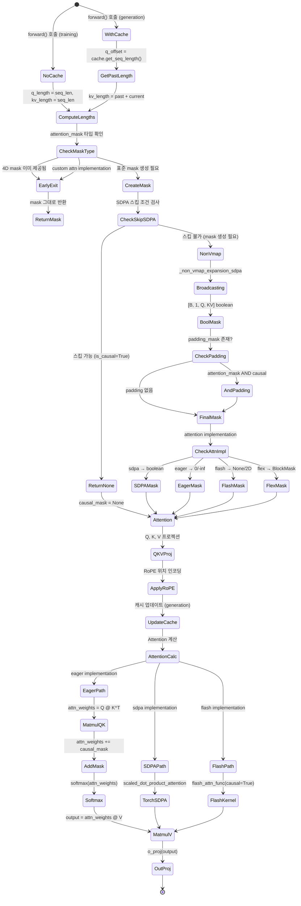

# 03 - Domain Logic and State: Llama Mask System

## 주요 알고리즘: Causal Mask 생성

### 알고리즘 1: Basic Causal Mask (Non-Vmap Broadcasting)

```python
def _non_vmap_expansion_sdpa(batch_indices, head_indices, q_indices, kv_indices):
    """
    Broadcasting을 사용한 고속 마스크 생성 알고리즘
    
    핵심 아이디어:
    - NumPy/PyTorch broadcasting을 이용해 element-wise 비교 수행
    - vmap 오버헤드 없이 순수 텐서 연산으로 4D mask 생성
    - Index-based mask function 전용 (causal_mask_function 등)
    
    입력:
    - batch_indices: [B] = [0, 1, 2, ..., B-1]
    - head_indices: [1] = [0]
    - q_indices: [Q] = [q_offset, q_offset+1, ..., q_offset+Q-1]
    - kv_indices: [KV] = [kv_offset, kv_offset+1, ..., kv_offset+KV-1]
    
    출력:
    - attention_mask: [B, 1, Q, KV] boolean tensor
    """
    # 1. 차원 확장 (unsqueeze + broadcast 준비)
    batch_indices = batch_indices[:, None, None, None]    # [B, 1, 1, 1]
    head_indices = head_indices[None, :, None, None]      # [1, 1, 1, 1]
    q_indices = q_indices[None, None, :, None]            # [1, 1, Q, 1]
    kv_indices = kv_indices[None, None, None, :]          # [1, 1, 1, KV]
    
    # 2. mask_function에 전달
    # causal_mask_function(batch_idx, head_idx, q_idx, kv_idx):
    #   return kv_idx <= q_idx
    
    # 3. Broadcasting으로 자동 확장
    # kv_indices [1, 1, 1, KV]  --broadcast-->  [B, 1, Q, KV]
    # q_indices  [1, 1, Q, 1]   --broadcast-->  [B, 1, Q, KV]
    # 비교 연산: kv_indices <= q_indices
    # 결과: [B, 1, Q, KV] boolean tensor
    
    return batch_indices, head_indices, q_indices, kv_indices

# 실제 사용:
batch_arange = torch.arange(batch_size, device=device)      # [0, 1, ..., B-1]
head_arange = torch.arange(1, device=device)                # [0]
q_arange = torch.arange(q_length, device=device) + q_offset # [q_offset, ..., q_offset+Q-1]
kv_arange = torch.arange(kv_length, device=device) + kv_offset

# mask_function에 전달
attention_mask = mask_function(
    * _non_vmap_expansion_sdpa(batch_arange, head_arange, q_arange, kv_arange)
)

# 결과 확장 (batch, head가 사용되지 않은 경우)
attention_mask = attention_mask.expand(batch_size, -1, q_length, kv_length)
```

**예시 시각화** (batch_size=1, q_length=5, kv_length=5, q_offset=0, kv_offset=0):

```
q_indices:  [0, 1, 2, 3, 4]  → shape [1, 1, 5, 1]
kv_indices: [0, 1, 2, 3, 4]  → shape [1, 1, 1, 5]

Broadcasting:
q_indices:   [[[[0], [1], [2], [3], [4]]]]      # [1, 1, 5, 1]
kv_indices:  [[[[0, 1, 2, 3, 4]]]]              # [1, 1, 1, 5]

비교 (kv_indices <= q_indices):
q\kv  0      1      2      3      4
0:    0<=0 T  0<=1 T  0<=2 F  0<=3 F  0<=4 F  → [T F F F F]
1:    1<=0 F  1<=1 T  1<=2 F  1<=3 F  1<=4 F  → [F T F F F]  # WRONG!
2:    2<=0 F  2<=1 F  2<=2 T  2<=3 F  2<=4 F  → [F F T F F]  # WRONG!

# 실제론 broadcasting이 다르게 작동:
q_indices:   [B, 1, Q, 1]  → 각 q_idx가 마지막 차원에 대해 repeat
kv_indices:  [B, 1, 1, KV] → 각 kv_idx가 Q 차원에 대해 repeat

Correct Broadcasting:
q_idx=0 row: kv_indices [0,1,2,3,4] <= q_idx=0 → [T,F,F,F,F]
q_idx=1 row: kv_indices [0,1,2,3,4] <= q_idx=1 → [T,T,F,F,F]
q_idx=2 row: kv_indices [0,1,2,3,4] <= q_idx=2 → [T,T,T,F,F]
q_idx=3 row: kv_indices [0,1,2,3,4] <= q_idx=3 → [T,T,T,T,F]
q_idx=4 row: kv_indices [0,1,2,3,4] <= q_idx=4 → [T,T,T,T,T]

최종 mask [1, 1, 5, 5]:
[[[[ T, F, F, F, F],
   [ T, T, F, F, F],
   [ T, T, T, F, F],
   [ T, T, T, T, F],
   [ T, T, T, T, T]]]]
```

### 알고리즘 2: Vmap-based Mask Creation (Torch >= 2.6)

```python
def _vmap_expansion_sdpa(mask_function: Callable) -> Callable:
    """
    torch.vmap을 사용한 범용 마스크 생성
    
    장점:
    - 임의의 mask_function 지원 (index-based 아닐 수도 있음)
    - 커스텀 패턴 (이미지 토큰, packed sequence 등) 처리 가능
    - 함수형 프로그래밍 스타일
    
    단점:
    - vmap 오버헤드로 인해 non-vmap보다 1.5-2배 느림
    - torch >= 2.6 필요
    - TransformGetItemToIndex 컨텍스트 필요 (vmap 호환성)
    
    동작 원리:
    1. mask_function을 4개 차원에 대해 순차적으로 vmap
    2. 각 vmap은 해당 차원을 따라 함수를 vectorize
    3. 최종적으로 4D mask 생성
    """
    # 4개 차원에 대해 순차적으로 vmap 적용
    dimensions = [
        (None, None, None, 0),  # kv_idx 차원으로 vmap (out: 0)
        (None, None, 0, None),  # q_idx 차원으로 vmap (out: 0)
        (None, 0, None, None),  # head_idx 차원으로 vmap (out: 0)
        (0, None, None, None),  # batch_idx 차원으로 vmap (out: 0)
    ]
    
    for dims in dimensions:
        # torch.vmap: 함수를 특정 차원을 따라 vectorize
        # in_dims: 각 입력 인자의 매핑 차원 (None이면 broadcast)
        # out_dims: 출력의 매핑 차원
        mask_function = torch.vmap(mask_function, in_dims=dims, out_dims=0)
    
    return mask_function

# 사용 예시:
with TransformGetItemToIndex():  # vmap에서 tensor slicing 지원
    attention_mask = _vmap_expansion_sdpa(mask_function)(
        batch_arange, head_arange, q_arange, kv_arange
    )
    # 결과: [B, 1, Q, KV] boolean tensor
```

**vmap 동작 예시**:

```python
# causal_mask_function: (batch_idx, head_idx, q_idx, kv_idx) -> bool

# Step 1: kv_idx 차원으로 vmap
# Input: (scalar, scalar, scalar, [0,1,2,3,4])
# Output: [kv_idx<=q_idx for kv_idx in [0,1,2,3,4]]
# 예: q_idx=2 → [T, T, T, F, F]

# Step 2: q_idx 차원으로 vmap
# Input: (scalar, scalar, [0,1,2,3,4], [0,1,2,3,4])
# Output: 각 q_idx에 대해 Step 1 결과 stack
# [[T,F,F,F,F], [T,T,F,F,F], [T,T,T,F,F], ...]

# Step 3: head_idx 차원으로 vmap (head=1이므로 효과 없음)
# Step 4: batch_idx 차원으로 vmap (batch_size만큼 repeat)
```

### 알고리즘 3: Packed Sequence Detection

```python
def find_packed_sequence_indices(position_ids: torch.Tensor) -> torch.Tensor | None:
    """
    Packed sequence 형식 감지 알고리즘
    
    문제:
    - 여러 시퀀스를 한 배치로 묶은 경우 (packed tensor)
    - 시퀀스 간 attend 방지를 위해 mask 필요
    - position_ids로부터 시퀀스 경계 감지 필요
    
    아이디어:
    - 동일 시퀀스 내 position_ids는 연속적 (diff = 1)
    - 시퀀스 경계에서 diff != 1
    - cumsum으로 시퀀스 인덱스 생성
    
    입력:
    - position_ids: [batch_size, seq_len]
    - 예: [[0, 1, 0, 1, 2, 0]] (3개 시퀀스 packed)
      - Seq A: 2 tokens (position 0, 1)
      - Seq B: 3 tokens (position 0, 1, 2)
      - Seq C: 1 token (position 0)
    
    출력:
    - packed_sequence_mask: [batch_size, seq_len]
    - 예: [[0, 0, 1, 1, 1, 2]]
      - index 0,1: Seq A (value 0)
      - index 2,3,4: Seq B (value 1)
      - index 5: Seq C (value 2)
    """
    # 1. 첫 번째 위치에 더미 값 추가 (diff 계산용)
    first_dummy_value = position_ids[:, :1] - 1  # [batch, 1]
    # 예: [[0, 1, 0, 1, 2, 0]] → first_dummy_value = [[-1]]
    
    # 2. Diff 계산 (연속 여부 확인)
    position_diff = torch.diff(position_ids, prepend=first_dummy_value, dim=-1)
    # prepend=[[-1]] → diff([[−1, 0, 1, 0, 1, 2, 0]])
    # = [[1, 1, -1, 1, 1, -2, -2]]
    #   ↑    ↑     ↑    ↑     ↑
    #   T    T    F     T     T    (diff==1인 경우만 True)
    
    # 3. diff != 1인 위치 찾기 (시퀀스 경계)
    # position_diff != 1:
    # [[F, F, T, F, F, T, T]]
    #   0  1  2  3  4  5  6  (index)
    #   ↑     ↑        ↑  ↑
    #   OK   OK   BOUND  BOUND
    
    # 4. Cumsum으로 시퀀스 인덱스 생성
    packed_sequence_mask = (position_diff != 1).cumsum(-1)
    # cumsum([F, F, T, F, F, T, T]) = [0, 0, 1, 1, 1, 2, 3]
    # → 각 값이 시퀀스 인덱스
    
    # 5. 단일 시퀀스인 경우 None 반환 (packed 아님)
    if not is_tracing(packed_sequence_mask) and (packed_sequence_mask[:, -1] == 0).all():
        return None
    
    return packed_sequence_mask
```

**Packed Sequence Mask 적용**:

```python
# Packed sequence 감지 시 마스크 조합
if packed_sequence_mask is not None:
    # 서로 다른 시퀀스 간 attend 차단
    mask_factory_function = and_masks(
        mask_factory_function,  # causal_mask_function
        packed_sequence_mask_function(packed_sequence_mask)
    )
    allow_is_causal_skip = False  # 스킵 불가

def packed_sequence_mask_function(packed_sequence_mask: torch.Tensor) -> Callable:
    """
    같은 시퀀스 내 토큰만 attend 허용
    
    로직: packed_sequence_mask[batch, q_idx] == packed_sequence_mask[batch, kv_idx]
    """
    def inner_mask(batch_idx, head_idx, q_idx, kv_idx):
        return packed_sequence_mask[batch_idx, q_idx] == \
               packed_sequence_mask[batch_idx, kv_idx]
    return inner_mask

# 예시:
# packed_sequence_mask: [[0, 0, 1, 1, 1, 2]]
# q_idx=0, kv_idx=1: 0 == 0 → T (attend 허용, 동일 시퀀스)
# q_idx=0, kv_idx=2: 0 == 1 → F (attend 차단, 다른 시퀀스)
# q_idx=2, kv_idx=4: 1 == 1 → T (attend 허용, 동일 시퀀스)
```

### 알고리즘 4: 마스크 스킵 최적화 (SDPA)

```python
def _ignore_causal_mask_sdpa(
    padding_mask: torch.Tensor | None,
    query_length: int,
    kv_length: int,
    kv_offset: int,
    local_attention_size: int | None = None,
) -> bool:
    """
    SDPA에서 causal mask 생성 스킵 조건 검사
    
    목적:
    - 마스크 생성 없이 SDPA의 is_causal=True 인자 사용
    - Flash Attention 커널 활성화 (2-3배 속도 향상)
    - 메모리 사용량 감소
    
    스킵 조건 (모두 만족해야 함):
    1. Tracing 중이 아님 (torch.export/dynamo 호환성)
    2. query_length == 1 (decoding) 또는 kv_length == query_length (prefill)
    3. local_attention_size가 None이거나 kv_length < local_attention_size
    4. padding_mask가 None이거나 모두 True (padding 없음)
    
    반환:
    - True: 마스크 생성 스킵 (SDPA의 is_causal=True 사용)
    - False: 마스크 생성 필요
    """
    # XPU 특수 처리
    if _is_torch_xpu_available:
        return _can_skip_causal_mask_xpu(padding_mask, query_length, kv_length, local_attention_size)
    
    # Tracing 중이면 스킵 안 함
    if is_tracing(padding_mask):
        return False
    
    # 조건 검사
    if (
        # 1. Tracing 중이 아님
        not is_tracing(padding_mask)
        # 2. Full causal attention 가능
        and (query_length == 1 or kv_length == query_length)
        # 3. Sliding window 제한 없음
        and (local_attention_size is None or kv_length < local_attention_size)
        # 4. Padding 없음
        and (padding_mask is None or padding_mask.all())
    ):
        return True
    
    return False
```

**스킵 조건 시나리오**:

| 시나리오 | query_length | kv_length | padding | local_size | 스킵 가능? | 이유 |
|----------|-------------|-----------|---------|------------|-----------|------|
| Prefill (no padding) | 512 | 512 | None | None | ✅ | q_length == kv_length |
| Prefill (padding) | 512 | 512 | [T,T,F] | None | ❌ | padding 있음 |
| Decoding (batch=1) | 1 | 100 | None | None | ✅ | query_length == 1 |
| Decoding (batch=16, padding) | 1 | 105 | [T,T,T,F] | None | ❌ | padding 있음 |
| Sliding window | 512 | 512 | None | 4096 | ❌ | kv_length < local_size 아님 |
| Tracing 중 | 512 | 512 | None | None | ❌ | is_tracing=True |

## 가변 상태 (Mutable State)

### 1. Past Key Values (캐시)

```python
# 캐시 구조 (DynamicCache)
class DynamicCache(Cache):
    """
    동적 길이 캐시
    
    상태:
    - key_cache: List[torch.Tensor]  # 레이어별 key states
    - value_cache: List[torch.Tensor]  # 레이어별 value states
    - is_compileable: bool  # 컴파일 가능 여부
    
    라이프사이클:
    1. 생성: DynamicCache(config) → 빈 캐시
    2. 업데이트: cache.update(key, value, layer_idx) → append
    3. 조회: cache.get_seq_length() → 과거 토큰 수
    4. 마스크 크기: cache.get_mask_sizes(q_length, layer_idx)
    """
    
    def get_seq_length(self) -> int:
        """과거에 처리된 토큰 수 반환"""
        if len(self.key_cache) == 0:
            return 0
        return self.key_cache[0].shape[-2]  # [batch, heads, seq_len, head_dim]
    
    def get_mask_sizes(self, q_length: int, layer_idx: int) -> tuple[int, int]:
        """
        마스크 크기 계산
        
        반환:
        - kv_length: 전체 KV 시퀀스 길이 (past + current)
        - kv_offset: KV 시작 오프셋 (항상 0)
        """
        past_length = self.get_seq_length()
        kv_length = past_length + q_length
        kv_offset = 0
        return kv_length, kv_offset
    
    def update(
        self,
        key_states: torch.Tensor,
        value_states: torch.Tensor,
        layer_idx: int,
    ) -> tuple[torch.Tensor, torch.Tensor]:
        """
        캐시 업데이트 (append)
        
        입력:
        - key_states: [batch, heads, q_length, head_dim] (new tokens)
        - value_states: [batch, heads, q_length, head_dim] (new tokens)
        
        동작:
        1. 레이어별 캐시에 append
        2. 전체 시퀀스 반환 (past + current)
        
        반환:
        - updated_key: [batch, heads, past+q_length, head_dim]
        - updated_value: [batch, heads, past+q_length, head_dim]
        """
        if layer_idx >= len(self.key_cache):
            # 새 레이어: 초기화
            self.key_cache.append(key_states)
            self.value_cache.append(value_states)
        else:
            # 기존 레이어: append
            self.key_cache[layer_idx] = torch.cat(
                [self.key_cache[layer_idx], key_states], dim=-2
            )
            self.value_cache[layer_idx] = torch.cat(
                [self.value_cache[layer_idx], value_states], dim=-2
            )
        
        return self.key_cache[layer_idx], self.value_cache[layer_idx]
```

**캐시 사용 시 마스크 변화**:

```python
# Training (no cache)
q_length = 512, kv_length = 512
q_offset = 0, kv_offset = 0
q_arange = [0, 1, ..., 511]
kv_arange = [0, 1, ..., 511]
# mask: [512, 512]

# Generation step 1 (first 100 tokens processed)
past_key_values.update(key_100, value_100, layer_idx)
# cache: 100 past tokens

# Generation step 2 (next 5 tokens)
q_length = 5, kv_length = 105 (100 past + 5 current)
q_offset = 100, kv_offset = 0
q_arange = [100, 101, 102, 103, 104]
kv_arange = [0, 1, ..., 104]

# mask 생성
# q_idx=0 (실제 position 100): kv_idx <= 100 → [T(0), T(1), ..., T(100), F(101), ...]
# q_idx=1 (실제 position 101): kv_idx <= 101 → [T(0), T(1), ..., T(101), F(102), ...]
# ...
# 결과: [5, 105] mask (각 new token이 모든 past + current attend)
```

### 2. 상태 전이 다이어그램



### 3. Attention Implementation별 마스크 포맷 변환

```python
# SDPA: boolean mask
# True: attend 허용, False: attend 차단
sdpa_mask = tensor([[[[ T, F, F, F],
                      [ T, T, F, F],
                      [ T, T, T, F],
                      [ T, T, T, T]]]])

# Eager: float mask (0/-inf)
# 0.0: attend 허용, -inf: attend 차단
eager_mask = tensor([[[[ 0.0, -inf, -inf, -inf],
                       [ 0.0,  0.0, -inf, -inf],
                       [ 0.0,  0.0,  0.0, -inf],
                       [ 0.0,  0.0,  0.0,  0.0]]]])

# Flash Attention: None 또는 2D mask
# None: causal=True로 처리
# 2D: padding 정보만 전달
flash_mask = None  # 또는 [B, KV]

# Flex Attention: BlockMask
# 희소 블록 압축 표현
flex_mask = BlockMask(
    row_blocks=...,  # 블록화된 행 인덱스
    col_blocks=...,  # 블록화된 열 인덱스
)
```
