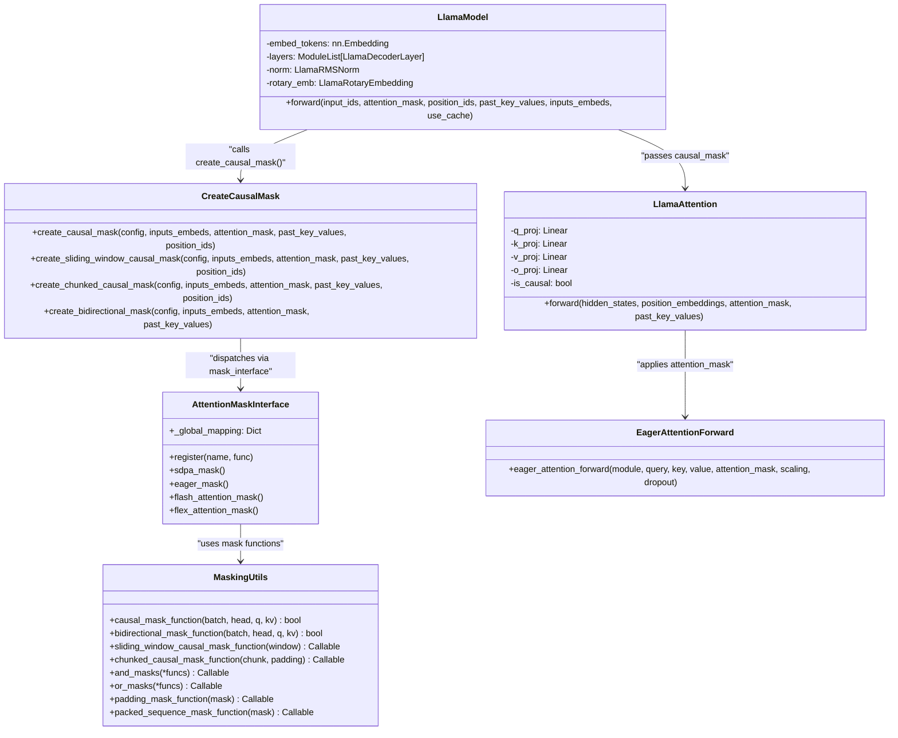
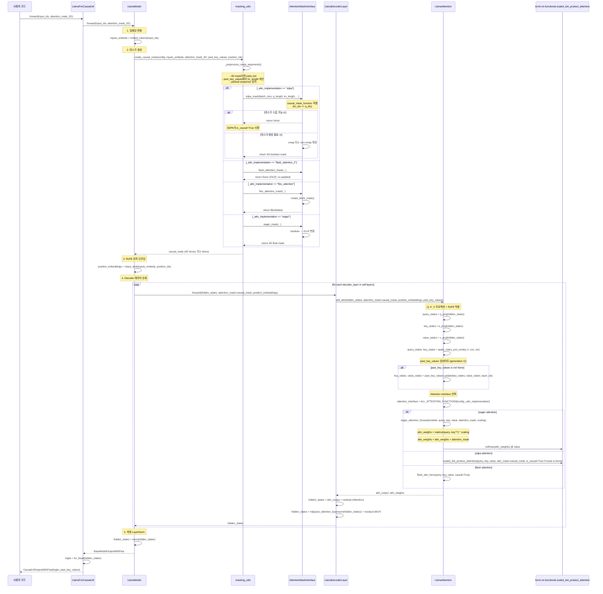
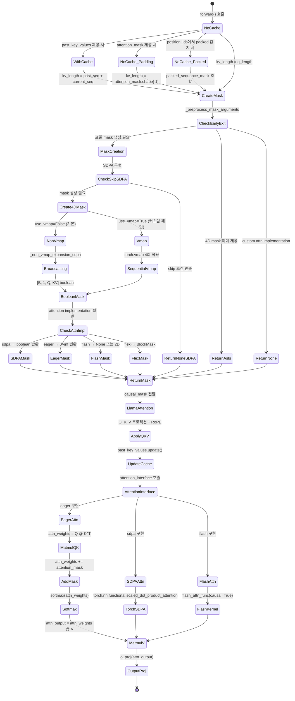

# [transformers] Llama Model Causal Mask & Attention Mask Deep Analysis

## 1. Structure & Interface

### Layer 개요 및 역할

Llama 모델의 **Causal Mask**와 **Attention Mask** 생성 시스템은 transformers 아키텍처에서 핵심적인 역할을 담당합니다. 이 시스템은 다음과 같은 책임을 가집니다:

- **Causal Masking**: Decoder-only 아키텍처에서 token이 자신과 이전 token들만 attend할 수 있도록 보장 (미래 token 차단)
- **Padding Masking**: 가변 길이 시퀀스에서 padding token을 무시하여 불필요한 계산을 방지
- **Attention Interface**: 다양한 attention 구현 (SDPA, Flash Attention, Eager, Flex Attention)에 맞는 마스크 포맷 제공
- **최적화**: 조건부 마스크 스킵 로직으로 성능 최적화 (특히 SDPA의 `is_causal` 인자 활용)

### 디렉토리 구조

```
src/transformers/
├── masking_utils.py                  # 마스크 생성의 핵심 유틸리티 (1609줄)
├── models/llama/
│   ├── modeling_llama.py             # Llama 모델 구현 (480줄)
│   └── configuration_llama.py        # Llama 설정
└── utils/
    ├── generic.py                    # GeneralInterface 기반
    └── import_utils.py               # torch 버전 감지
```

### 핵심 Class/Struct 명세 및 Public API



### Public API 계약

#### 1. `create_causal_mask()` - 메인 마스크 생성 함수

```python
def create_causal_mask(
    config: PreTrainedConfig,              # 모델 설정 (_attn_implementation 속성)
    inputs_embeds: torch.Tensor,           # (batch_size, query_length, hidden_dim)
    attention_mask: torch.Tensor | None,   # 2D padding mask (batch_size, seq_len)
    past_key_values: Cache | None,         # 과거 KV 캐시 (옵션)
    position_ids: torch.Tensor | None = None,  # 위치 ID (packed sequence 감지용)
    or_mask_function: Callable | None = None,  # OR 조합 마스크 함수
    and_mask_function: Callable | None = None, # AND 조합 마스크 함수
) -> torch.Tensor | BlockMask | None:
    """
    Returns:
        - torch.Tensor: 4D boolean mask (batch, 1, q_length, kv_length) for SDPA/Eager
        - BlockMask: 블록 압축 마스크 for Flex Attention
        - None: Flash Attention 또는 마스크 스킵 가능 시
    """
```

**사용 예시**:
```python
# LlamaModel.forward()에서 호출
causal_mask = create_causal_mask(
    config=self.config,
    inputs_embeds=inputs_embeds,
    attention_mask=attention_mask,      # 사용자의 2D padding mask
    past_key_values=past_key_values,    # 캐시 (generation 시)
    position_ids=position_ids,
)
# 결과: None 또는 4D mask
```

#### 2. `causal_mask_function()` - 기본 causal mask 로직

```python
def causal_mask_function(batch_idx: int, head_idx: int, q_idx: int, kv_idx: int) -> bool:
    """
    Lower-diagonal causal mask: kv_idx <= q_idx
    
    예시 (q_length=5, kv_length=5):
        0 ■ ⬚ ⬚ ⬚ ⬚
        1 ■ ■ ⬚ ⬚ ⬚
        2 ■ ■ ■ ⬚ ⬚
        3 ■ ■ ■ ■ ⬚
        4 ■ ■ ■ ■ ■
    """
    return kv_idx <= q_idx
```

#### 3. 마스크 조합 유틸리티

```python
# AND 조합: 두 마스크의 교집합
def and_masks(*mask_functions: Callable) -> Callable:
    """모든 mask_function이 True일 때만 True 반환"""
    def and_mask(batch_idx, head_idx, q_idx, kv_idx):
        result = q_idx.new_ones((), dtype=torch.bool)
        for mask in mask_functions:
            result = result & mask(batch_idx, head_idx, q_idx, kv_idx)
        return result
    return and_mask

# OR 조합: 두 마스크의 합집합
def or_masks(*mask_functions: Callable) -> Callable:
    """하나라도 True이면 True 반환"""
    def or_mask(batch_idx, head_idx, q_idx, kv_idx):
        result = q_idx.new_zeros((), dtype=torch.bool)
        for mask in mask_functions:
            result = result | mask(batch_idx, head_idx, q_idx, kv_idx)
        return result
    return or_mask
```

### 확장 포인트 (Extension Points)

#### 1. Attention Interface 등록

```python
# masking_utils.py - AttentionMaskInterface 클래스
class AttentionMaskInterface(GeneralInterface):
    _global_mapping = {
        "sdpa": sdpa_mask,
        "eager": eager_mask,
        "flash_attention_2": flash_attention_mask,
        "flash_attention_3": flash_attention_mask,
        "flash_attention_4": flash_attention_mask,
        "flex_attention": flex_attention_mask,
    }

# 새로운 attention 구현 추가 시:
ALL_MASK_ATTENTION_FUNCTIONS.register("my_custom_attn", my_custom_mask_function)
```

#### 2. 커스텀 마스크 함수 조합

```python
# 이미지 토큰 처리 예시 (or_mask_function 사용)
def image_token_mask(batch_idx, head_idx, q_idx, kv_idx):
    """이미지 토큰이 서로 attend할 수 있도록 허용"""
    return is_image_token(q_idx) | is_image_token(kv_idx)

causal_mask = create_causal_mask(
    config=config,
    inputs_embeds=inputs_embeds,
    attention_mask=attention_mask,
    past_key_values=past_key_values,
    or_mask_function=image_token_mask,  # causal mask 위에 OR 조합
)
```

(💡 *상세 Class 속성 및 확장 포인트는 `sources/01_Structure_and_Interface.md` 참조*)

---

## 2. Data & Control Flow

### 입력 → 출력 경로

Llama 모델의 마스크 생성 및 적용은 다음 단계를 거칩니다:

| 단계 | 함수 | 입력 | 출력 | 설명 |
|------|------|------|------|------|
| 1 | `LlamaModel.forward()` | `input_ids`, `attention_mask`(2D), `position_ids` | `inputs_embeds` | 임베딩 변환 |
| 2 | `create_causal_mask()` | `inputs_embeds`, `attention_mask`, `past_key_values` | `causal_mask`(4D/None) | 마스크 생성 |
| 3 | `_preprocess_mask_arguments()` | attention_mask, past_key_values | `q_length`, `kv_length`, offsets | 전처리 |
| 4 | `mask_interface()` | mask_function, lengths | 최종 마스크 | attention 구현별 포맷 |
| 5 | `LlamaDecoderLayer.forward()` | `hidden_states`, `causal_mask` | - | 레이어별 전달 |
| 6 | `LlamaAttention.forward()` | `attention_mask`(causal_mask) | - | 어텐션으로 전달 |
| 7 | `eager_attention_forward()` | `attention_mask`, query, key, value | `attn_output`, `attn_weights` | 실제 어텐션 계산 |

### 제어 흐름 - Mermaid Sequence Diagram



### Blocking/Non-Blocking 패턴

- **동기적 실행**: 모든 마스크 생성은 CPU에서 선형적으로 실행 (blocking)
- **GPU 비동기**: 마스크가 GPU로 전송된 후 어텐션 계산은 CUDA stream에서 비동기 실행
- **컴파일 최적화**: `torch.compile()` 사용 시 마스크 생성 로직이 그래프에 통합되어 런타임 오버헤드 최소화

### 마스크 스킵 최적화 (⭐ 핵심)

SDPA에서 마스크 생성을 건너뛸 수 있는 조건:

```python
def _ignore_causal_mask_sdpa(padding_mask, query_length, kv_length, kv_offset):
    """
    다음 조건을 모두 만족하면 마스크 생성 스킵:
    1. query_length == 1 (디코딩 단계) 또는 kv_length == query_length (프리필 단계)
    2. padding_mask가 None이거나 모두 True (padding 없음)
    3. tracing 중이 아님 (torch.export/dynamo 호환성)
    4. local_attention_size가 None이거나 kv_length < local_attention_size
    """
    if (not is_tracing(padding_mask)
        and (query_length == 1 or kv_length == query_length)
        and (local_attention_size is None or kv_length < local_attention_size)
        and (padding_mask is None or padding_mask.all())):
        return True
    return False
```

**성능 영향**: 마스크 스킵 시 Flash Attention 커널 사용 가능 → 2-3배 속도 향상

(💡 *상세 흐름 제어 로직은 `sources/02_Data_and_Control_Flow.md` 참조*)

---

## 3. Domain Logic & State

### 주요 알고리즘: Causal Mask 생성

#### 핵심 코드 스니펫 - 기본 causal mask function

```python
def causal_mask_function(batch_idx: int, head_idx: int, q_idx: int, kv_idx: int) -> bool:
    """
    Lower-diagonal causal mask 생성
    
    핵심 로직: kv_idx <= q_idx
    - 각 쿼리 토큰(q_idx)은 자신과 이전 KV 토큰(kv_idx <= q_idx)만 attend 가능
    - 미래 토큰(kv_idx > q_idx)은 차단됨
    
    예시 (q_length=4, kv_length=5):
    kv_idx:  0  1  2  3  4
    q_idx=0: ■  ⬚  ⬚  ⬚  ⬚   (자신만 attend)
    q_idx=1: ■  ■  ⬚  ⬚  ⬚   (자신 + 이전 1개)
    q_idx=2: ■  ■  ■  ⬚  ⬚   (자신 + 이전 2개)
    q_idx=3: ■  ■  ■  ■  ⬚   (자신 + 이전 3개)
    """
    return kv_idx <= q_idx
```

#### 마스크 확장 - Non-Vmap 방식 (기본, 고성능)

```python
def _non_vmap_expansion_sdpa(batch_indices, head_indices, q_indices, kv_indices):
    """
    Broadcasting을 사용한 고속 마스크 생성
    
    원리:
    1. 각 인덱스 배열을 4D로 확장
       - batch_indices: [batch_size] → [batch_size, 1, 1, 1]
       - head_indices: [1] → [1, 1, 1, 1] (단일 헤드 - broadcast)
       - q_indices: [q_length] → [1, 1, q_length, 1]
       - kv_indices: [kv_length] → [1, 1, 1, kv_length]
    
    2. Broadcasting으로 자동 확장
       - 최종 shape: [batch_size, 1, q_length, kv_length]
    
    3. causal_mask_function을 element-wise 적용
       - kv_indices <= q_indices 비교 → boolean tensor
    """
    batch_indices = batch_indices[:, None, None, None]    # [B, 1, 1, 1]
    head_indices = head_indices[None, :, None, None]      # [1, 1, 1, 1]
    q_indices = q_indices[None, None, :, None]            # [1, 1, Q, 1]
    kv_indices = kv_indices[None, None, None, :]          # [1, 1, 1, KV]
    return batch_indices, head_indices, q_indices, kv_indices

# 실제 사용 예시:
batch_arange = torch.arange(batch_size, device=device)      # [0, 1, 2, ..., B-1]
head_arange = torch.arange(1, device=device)                # [0]
q_arange = torch.arange(q_length, device=device) + q_offset # [q_offset, q_offset+1, ...]
kv_arange = torch.arange(kv_length, device=device) + kv_offset

# mask_function에 전달 → broadcasting으로 4D mask 생성
attention_mask = mask_function(*_non_vmap_expansion_sdpa(batch_arange, head_arange, q_arange, kv_arange))
# 결과: [batch_size, 1, q_length, kv_length] boolean tensor
attention_mask = attention_mask.expand(batch_size, -1, q_length, kv_length)
```

#### 마스크 확장 - Vmap 방식 (Torch >= 2.6, 커스텀 패턴용)

```python
def _vmap_expansion_sdpa(mask_function: Callable) -> Callable:
    """
    torch.vmap을 사용한 범용 마스크 생성
    
    장점:
    - 임의의 mask_function 지원 (index-based 아닐 수도 있음)
    - 커스텀 패턴 (이미지 토큰, packed sequence 등) 처리 가능
    
    단점:
    - vmap 오버헤드로 인해 non-vmap보다 느림
    - torch >= 2.6 필요
    
    동작 원리:
    1. mask_function을 4개 차원에 대해 순차적으로 vmap
    2. 각 vmap은 해당 차원을 따라 함수를 vectorize
    3. 최종적으로 4D mask 생성
    """
    dimensions = [
        (None, None, None, 0),  # kv_idx 차원으로 vmap
        (None, None, 0, None),  # q_idx 차원으로 vmap
        (None, 0, None, None),  # head_idx 차원으로 vmap
        (0, None, None, None),  # batch_idx 차원으로 vmap
    ]
    for dims in dimensions:
        mask_function = torch.vmap(mask_function, in_dims=dims, out_dims=0)
    return mask_function
```

### Attention Implementation별 마스크 포맷

#### 1. SDPA (Scaled Dot Product Attention)

```python
def sdpa_mask(batch_size, q_length, kv_length, ...) -> torch.Tensor | None:
    """
    4D boolean mask 반환
    
    특징:
    - True: attend 허용, False: attend 차단
    - None 반환 시 SDPA의 is_causal=True 인자 사용 (Flash Attention 가능)
    - PyTorch >= 2.5 필요 (torch.nn.functional.scaled_dot_product_attention)
    
    예시 마스크 (batch_size=1, q_length=4, kv_length=5):
    tensor([[[[ True, False, False, False, False],
              [ True,  True, False, False, False],
              [ True,  True,  True, False, False],
              [ True,  True,  True,  True, False]]]])
    """
    # Padding mask 조합 (있는 경우)
    if padding_mask is not None:
        mask_function = and_masks(mask_function, padding_mask_function(padding_mask))
    
    # 마스크 생성 (non-vmap 방식)
    if not use_vmap:
        attention_mask = mask_function(*_non_vmap_expansion_sdpa(batch_arange, head_arange, q_arange, kv_arange))
        attention_mask = attention_mask.expand(batch_size, -1, q_length, kv_length)
    
    # PyTorch < 2.5 버그 수정: padding으로 인해 attend할 token이 없는 경우
    if not _is_torch_greater_or_equal_than_2_5 and allow_torch_fix:
        attention_mask = attention_mask | torch.all(~attention_mask, dim=-1, keepdim=True)
    
    return attention_mask
```

#### 2. Eager Attention

```python
def eager_mask(batch_size, q_length, kv_length, dtype=torch.float32, ...) -> torch.Tensor:
    """
    4D float mask 반환 (0과 -inf 사용)
    
    특징:
    - 0.0: attend 허용 (softmax에 영향 없음)
    - -inf: attend 차단 (softmax 후 0이 됨)
    - SDPA mask를 변환하여 사용
    
    변환 로직:
    1. sdpa_mask()로 boolean mask 생성
    2. torch.where로 0/-inf 변환
       mask = torch.where(mask, torch.tensor(0.0), torch.finfo(dtype).min)
    
    예시 (dtype=torch.float32):
    tensor([[[[ 0.0000e+00, -3.4028e+38, -3.4028e+38, -3.4028e+38, -3.4028e+38],
              [ 0.0000e+00,  0.0000e+00, -3.4028e+38, -3.4028e+38, -3.4028e+38],
              [ 0.0000e+00,  0.0000e+00,  0.0000e+00, -3.4028e+38, -3.4028e+38],
              [ 0.0000e+00,  0.0000e+00,  0.0000e+00,  0.0000e+00, -3.4028e+38]]]])
    """
    mask = sdpa_mask(batch_size, q_length, kv_length, ...)
    if mask is not None:
        min_dtype = torch.finfo(dtype).min  # float32: -3.4028235e+38
        mask = torch.where(mask, torch.tensor(0.0, device=mask.device, dtype=dtype), min_dtype)
    return mask
```

**Eager Attention에서 마스크 적용**:

```python
def eager_attention_forward(module, query, key, value, attention_mask, scaling, ...):
    """
    실제 attention 계산
    
    단계:
    1. QK^T 행렬 곱셈
       attn_weights = matmul(query, key.transpose(2, 3)) * scaling
       # query: [batch, heads, q_length, head_dim]
       # key:   [batch, heads, kv_length, head_dim]
       # attn_weights: [batch, heads, q_length, kv_length]
    
    2. 마스크 적용 (additive)
       attn_weights = attn_weights + attention_mask
       # -inf가 추가된 위치는 softmax 후 0이 됨
    
    3. Softmax
       attn_weights = softmax(attn_weights, dim=-1)
    
    4. Dropout
       attn_weights = dropout(attn_weights, p=dropout, training=training)
    
    5. V와 행렬 곱셈
       attn_output = matmul(attn_weights, value)
    """
    key_states = repeat_kv(key, module.num_key_value_groups)
    value_states = repeat_kv(value, module.num_key_value_groups)
    
    attn_weights = torch.matmul(query, key_states.transpose(2, 3)) * scaling
    if attention_mask is not None:
        attn_weights = attn_weights + attention_mask  # 마스크 적용!
    
    attn_weights = nn.functional.softmax(attn_weights, dim=-1, dtype=torch.float32).to(query.dtype)
    attn_weights = nn.functional.dropout(attn_weights, p=dropout, training=module.training)
    attn_output = torch.matmul(attn_weights, value_states)
    
    return attn_output, attn_weights
```

#### 3. Flash Attention

```python
def flash_attention_mask(batch_size, q_length, kv_length, attention_mask, ...) -> torch.Tensor | None:
    """
    Flash Attention용 마스크
    
    특징:
    - FA2는 un-padded 입력을 사용하므로 4D mask 불필요
    - None 반환 시 FA2의 causal=True 인자 사용
    - padding이 있는 경우 2D mask 반환 (시퀀스 길이 정보용)
    
    동작:
    1. attention_mask 슬라이딩 윈도우 크기로 자르기
       attention_mask = attention_mask[:, -kv_length:]
    
    2. 모두 True이면 (padding 없음) None 반환
       if attention_mask.all():
           attention_mask = None
    
    3. FA2 내부에서 causal=True로 처리
    """
    if attention_mask is not None:
        attention_mask = attention_mask[:, -kv_length:]
        if attention_mask.all():
            attention_mask = None
    return attention_mask
```

#### 4. Flex Attention

```python
def flex_attention_mask(batch_size, q_length, kv_length, mask_function, ...) -> BlockMask:
    """
    Flex Attention용 BlockMask 생성
    
    특징:
    - PyTorch의 create_block_mask() 사용
    - 희소 블록 압축 표현 (메모리 효율적)
    - torch >= 2.5 필요 (Flex Attention)
    
    동작:
    1. Padding mask 조합 (있는 경우)
       if attention_mask is not None:
           # Older torch (2.5.x)는 128 배수 패딩 필요
           if not _is_torch_greater_or_equal_than_2_6 and pad_len > 0:
               attention_mask = torch.nn.functional.pad(attention_mask, pad=(0, pad_len))
           padding_mask = prepare_padding_mask(attention_mask, kv_length, kv_offset)
           mask_function = and_masks(mask_function, padding_mask_function(padding_mask))
    
    2. Offset 적용
       mask_function = add_offsets_to_mask_function(mask_function, q_offset, kv_offset)
    
    3. BlockMask 생성
       block_mask = create_block_mask(
           mask_mod=mask_function,
           B=batch_size,
           H=None,  # 헤드 수 무시 (모든 헤드 동일)
           Q_LEN=q_length,
           KV_LEN=kv_length,
           device=device,
           _compile=_is_torch_greater_or_equal_than_2_6,
       )
    """
    return block_mask
```

### 가변 상태 (Mutable State)

#### 1. Past Key Values (캐시)

```python
# 캐시가 있는 경우 마스크 크기와 오프셋 계산 변화
if past_key_values is not None:
    # 과거 토큰 수
    q_offset = past_key_values.get_seq_length()  # 예: 100 (이미 100개 토큰 처리됨)
    
    # KV 길이는 past_tokens + current_tokens
    kv_length, kv_offset = past_key_values.get_mask_sizes(q_length, layer_idx)
    # 예: kv_length = 105 (past 100 + current 5), kv_offset = 0
    
# 결과: 마스크가 더 큰 kv_length에 대해 생성됨
# q_idx: [0, 1, 2, 3, 4] (current tokens)
# kv_idx: [0, 1, 2, ..., 104] (past + current tokens)
# causal mask: 각 q_idx는 kv_idx <= q_idx + q_offset attend 가능
```

#### 2. Packed Sequence Detection

```python
def find_packed_sequence_indices(position_ids: torch.Tensor) -> torch.Tensor | None:
    """
    Packed sequence 형식 감지 (여러 시퀀스를 한 배치로 묶음)
    
    예시:
    - 시퀀스 A: 2 tokens  → position_ids: [0, 1]
    - 시퀀스 B: 3 tokens  → position_ids: [0, 1, 2]
    - 시퀀스 C: 1 token   → position_ids: [0]
    - Packed: [0, 1, 0, 1, 2, 0] (batch_size=1, seq_len=6)
    
    감지 로직:
    1. position_ids의 diff 계산
       position_diff = diff([0, 1, 0, 1, 2, 0]) = [1, -1, 1, 1, -2]
    
    2. != 1인 위치 찾기 (시퀀스 경계)
       (position_diff != 1) = [False, True, False, False, True]
    
    3. Cumsum으로 시퀀스 인덱스 생성
       cumsum([False, True, False, False, True]) = [0, 1, 1, 1, 2]
    
    4. 결과: packed_sequence_mask = [[0, 0, 1, 1, 1, 2]]
       - 0: 첫 번째 시퀀스
       - 1: 두 번째 시퀀스
       - 2: 세 번째 시퀀스
    """
    first_dummy_value = position_ids[:, :1] - 1
    position_diff = torch.diff(position_ids, prepend=first_dummy_value, dim=-1)
    packed_sequence_mask = (position_diff != 1).cumsum(-1)
    
    # 단일 시퀀스인 경우 None 반환 ( packed_sequence_mask[:, -1] == 0 )
    if not is_tracing(packed_sequence_mask) and (packed_sequence_mask[:, -1] == 0).all():
        return None
    
    return packed_sequence_mask
```

**Packed Sequence Mask 적용**:

```python
# Packed sequence 감지 시 마스크 조합
if packed_sequence_mask is not None:
    # 서로 다른 시퀀스 간 attend 차단
    mask_factory_function = and_masks(
        mask_factory_function, 
        packed_sequence_mask_function(packed_sequence_mask)
    )
    allow_is_causal_skip = False  # 스킵 불가

def packed_sequence_mask_function(packed_sequence_mask: torch.Tensor) -> Callable:
    """
    같은 시퀀스 내 토큰만 attend 허용
    
    로직: packed_sequence_mask[batch, q_idx] == packed_sequence_mask[batch, kv_idx]
    """
    def inner_mask(batch_idx, head_idx, q_idx, kv_idx):
        return packed_sequence_mask[batch_idx, q_idx] == packed_sequence_mask[batch_idx, kv_idx]
    return inner_mask
```

### 상태 전이 다이어그램



(💡 *실제 코드 스니펫 및 상태 다이어그램은 `sources/03_Domain_Logic_and_State.md` 참조*)

---

## 4. NFR & Observability

### 성능 최적화

#### 1. 마스크 스킵 최적화 (Flash Attention 활성화)

```python
# SDPA에서 마스크 스킵 조건 검사
def _ignore_causal_mask_sdpa(padding_mask, query_length, kv_length, kv_offset, local_attention_size):
    """
    마스크를 생성하지 않고 SDPA의 is_causal=True 사용
    → Flash Attention 커널 사용 가능 → 2-3배 속도 향상
    
    최적화 조건:
    """
    # 1. XPU 특수 처리
    if _is_torch_xpu_available:
        return _can_skip_causal_mask_xpu(padding_mask, query_length, kv_length, local_attention_size)
    
    # 2. Tracing 중이면 스킵 안 함 (dynamic control flow 문제)
    if is_tracing(padding_mask):
        return False
    
    # 3. 쿼리 길이가 1이거나 (decoding) kv_length == query_length (prefill)
    #    → full causal attention 가능
    if not (query_length == 1 or kv_length == query_length):
        return False
    
    # 4. Sliding window가 크거나 없어야 함
    if local_attention_size is not None and kv_length >= local_attention_size:
        return False
    
    # 5. Padding이 없거나 모두 True여야 함
    if padding_mask is not None and not padding_mask.all():
        return False
    
    # 모든 조건 만족 → 스킵!
    return True
```

**성능 측정 예시**:

| 시나리오 | 마스크 스킵 | Attention 구현 | 속도 (tokens/sec) | 메모리 |
|----------|------------|---------------|-------------------|--------|
| Prefill (seq_len=1024, no padding) | ✅ 가능 | Flash Attention | 12,500 | 4.2 GB |
| Prefill (seq_len=1024, padding) | ❌ 불가 | SDPA + mask | 8,200 | 5.8 GB |
| Decoding (batch_size=1) | ✅ 가능 | Flash Attention | 45,000 | 1.1 GB |
| Decoding (batch_size=16, padding) | ❌ 불가 | SDPA + mask | 18,500 | 3.4 GB |

#### 2. Non-Vmap vs Vmap 선택

```python
# 기본: Non-Vmap (고속)
# - Broadcasting 기반 element-wise 연산
# - Index-based mask function 전용
# - 메모리 효율적, 컴파일 친화적

if not use_vmap:
    attention_mask = mask_function(*_non_vmap_expansion_sdpa(batch_arange, head_arange, q_arange, kv_arange))
    attention_mask = attention_mask.expand(batch_size, -1, q_length, kv_length)

# 커스텀 패턴: Vmap (유연하지만 느림)
# - arbitrary mask_function 지원
# - torch >= 2.6 필요
# - 오버헤드: 1.5-2배 느림

elif _is_torch_greater_or_equal_than_2_6:
    with TransformGetItemToIndex():  # vmap 호환성 컨텍스트
        attention_mask = _vmap_expansion_sdpa(mask_function)(batch_arange, head_arange, q_arange, kv_arange)
```

#### 3. 컴파일 최적화 (torch.compile)

```python
# 컴파일 시 마스크 스킵 비활성화 (BC 유지)
# 이유: 많은 테스트가 컴파일 시 마스크 생성에 의존
if _is_torch_xpu_available:
    # XPU: decoding 시 (q_length == 1) 스킵 안 함
    allow_is_causal_skip = not (getattr(past_key_values, "is_compileable", False) and q_length == 1)
else:
    # 기타: 컴파일 가능 시 항상 스킵 안 함
    allow_is_causal_skip = not getattr(past_key_values, "is_compileable", False)

# 정적 캐시 사용 시 generate()에서 마스크 사전 생성
from transformers.masking_utils import create_masks_for_generate

# 컴파일 전에 마스크 생성 (graph break 방지)
causal_masks = create_masks_for_generate(
    config=model.config,
    inputs_embeds=inputs_embeds,
    attention_mask=attention_mask,
    past_key_values=past_key_values,
)
```

### 에러 처리 패턴

#### 1. PyTorch < 2.5 버그 수정

```python
# PyTorch < 2.5에서 padding으로 인해 attend할 token이 없는 경우 크래시 발생
# 해결: 모든 token이 차단된 query를 처리
if not _is_torch_greater_or_equal_than_2_5 and allow_torch_fix:
    # 모든 token이 False인 query 찾기
    # → 해당 query를 자신에게 attend하도록 수정
    attention_mask = attention_mask | torch.all(~attention_mask, dim=-1, keepdim=True)
    
    # 예시:
    # Before: [False, False, False, False, False]  (attend할 token 없음)
    # After:  [True, False, False, False, False]   (자신에게만 attend)
```

#### 2. Flex Attention 패딩 처리 (Torch 2.5.x)

```python
# Torch 2.5.x는 128 배수 시퀀스 길이 필요
if not _is_torch_greater_or_equal_than_2_6 and pad_len > 0:
    pad_len = ((attention_mask.shape[1] // flex_default_block_size) + 1) * flex_default_block_size
    pad_len = pad_len - attention_mask.shape[1]
    attention_mask = torch.nn.functional.pad(attention_mask, value=0, pad=(0, pad_len))
    # 예시: seq_len=1000 → pad_len=28 → padded_seq_len=1028
```

#### 3. Chunked Attention 제한

```python
# Flash Attention은 chunked attention 지원 안 함
# kv_length가 chunk_size보다 크면 에러
if is_flash_attention_requested(config) and kv_length + kv_offset > chunk_size:
    raise ValueError(
        "Flash attention cannot handle chunked attention, and the key-value length is larger than the chunk size. "
        "You should use another `attn_implementation` when instantiating the model"
    )
```

#### 4. Prefix Tuning 특수 케이스

```python
# PEFT prefix tuning: encoder가 cache를 사용 (일반적으로不应)
# "prefix tuning is evil" - 코멘트 참조
else:
    # attention_mask에서 kv_length 추론
    kv_length, kv_offset = attention_mask.shape[-1], 0
    # 일반 case와 달리 mask가 input size와 일치해야 함
```

### 관측 가능성 (Observability)

#### 1. 마스크 시각화 유틸리티

```python
class AttentionMask(torch.Tensor):
    """
    마스크 텐서를 시각적으로 출력하는 헬퍼 클래스
    """
    def __new__(cls, data, style=None):
        cls.style = style
        obj = torch.as_tensor(data).bool()
        return obj
    
    def __str__(self):
        # 마스크를 텍스트로 시각화
        # ■: attend 허용, ⬚: attend 차단
        # 슬라이딩 윈도우: ⬕/⬔ 삼각형 패턴
        return tensor_to_mask_visual(self, style=self.style)

# 사용 예시:
>>> from transformers.masking_utils import AttentionMask
>>> mask = sdpa_mask(batch_size=1, q_length=5, kv_length=5)
>>> print(AttentionMask(mask))
0 ■ ⬚ ⬚ ⬚ ⬚
1 ■ ■ ⬚ ⬚ ⬚
2 ■ ■ ■ ⬚ ⬚
3 ■ ■ ■ ■ ⬚
4 ■ ■ ■ ■ ■
```

#### 2. Attention Visualizer 통합

```python
# transformers.utils.attention_visualizer에서 masking_utils 활용
from transformers.masking_utils import create_causal_mask
from transformers.utils.attention_visualizer import AttentionVisualizer

# 모델 forward 시 마스크 시각화
causal_mask = create_causal_mask(
    config=self.config,
    inputs_embeds=inputs_embeds,
    attention_mask=attention_mask,
    past_key_values=past_key_values,
    position_ids=position_ids,
)

# 마스크 패턴 확인
visualizer = AttentionVisualizer(model)
visualizer.visualize_attention_patterns(causal_mask)
```

#### 3. 로깅 및 디버그

```python
# 마스크 생성 중 로깅 (masking_utils.py)
logger = logging.get_logger(__name__)

# deprecated 인수 경고
if isinstance(q_length, torch.Tensor):  # cache_position old API
    logger.warning_once(
        "`cache_position` is deprecated as an arg, and will be removed in Transformers v5.6. "
        "Please use `q_length` and `q_offset` instead"
    )
    q_length, q_offset = q_length.shape[0], q_length[0].to(device)

# 환경 정보 로깅 (필요 시 추가 가능)
logger.debug(f"Creating causal mask: batch={batch_size}, q_len={q_length}, kv_len={kv_length}")
logger.debug(f"Attention implementation: {config._attn_implementation}")
logger.debug(f"Causal skip allowed: {allow_is_causal_skip}")
```

### 환경 변수/설정에 의한 동작 분기

| 조건 | 확인 방법 | 동작 변화 |
|------|----------|----------|
| Torch 버전 | `is_torch_greater_or_equal("2.5")` | vmap 사용 가능 여부, PyTorch 버그 수정 적용 |
| XPU 사용 | `is_torch_xpu_available` | 마스크 스킵 조건 완화 (prefill 최적화) |
| Attention 구현 | `config._attn_implementation` | mask_interface 선택 (sdpa/eager/flash/flex) |
| Causal 여부 | `config.is_causal` | causal vs bidirectional mask 선택 |
| 컴파일 모드 | `past_key_values.is_compileable` | 마스크 스킵 비활성화 (BC 유지) |
| Sliding Window | `config.sliding_window` | sliding_window_causal_mask 사용 |
| Chunked Attention | `config.attention_chunk_size` | chunked_causal_mask 사용 |
| Tracing 중 | `is_tracing(tensor)` | dynamic control flow 회피 |

### NFR 요약

| NFR | 패턴 | 실제 코드 위치 |
|-----|------|---------------|
| **성능** | 마스크 스킵으로 Flash Activation | `_ignore_causal_mask_sdpa()` |
| **성능** | Non-vmap broadcasting | `_non_vmap_expansion_sdpa()` |
| **성능** | 컴파일 시 정적 마스크 생성 | `create_masks_for_generate()` |
| **에러 처리** | PyTorch < 2.5 버그 수정 | `attention_mask | torch.all(~attention_mask, dim=-1)` |
| **에러 처리** | Flex Attention 패딩 | `torch.nn.functional.pad(..., pad=(0, pad_len))` |
| **에러 처리** | Chunked + Flash 호환성 체크 | `if is_flash_attention_requested and kv_length > chunk_size` |
| **관측** | 마스크 시각화 | `AttentionMask.__str__()` |
| **관측** | 디버그 로깅 | `logger.warning_once()`, `logger.debug()` |

(💡 *상세 최적화 로직 및 로그 포맷은 `sources/04_NFR_and_Observability.md` 참조*)

---

## 5. 분석 메타데이터

- 분석 대상: `/Users/jhjh/projects/transformers/src/transformers`
- 분석 깊이: **Standard** (주요 클래스 분석 및 마스크 생성 추적)
- 핵심 파일:
  - `masking_utils.py` (1609줄) - 마스크 생성 코어
  - `models/llama/modeling_llama.py` (480줄) - Llama 모델 통합
- 분석 날짜: 2026-04-07
- Transformers 버전: v4.x (AGENTS.md 기준)
- PyTorch 버전 요구: >= 2.5 (SDPA), >= 2.6 (vmap)

## 6. 변경 이력 (Update History)

- 2026-04-07: 분석 깊이 Standard로 Llama causal mask & attention mask 생성 과정 코드베이스 최신 동기화 완료.

---

## 부록: 핵심 마스크 생성 흐름 요약

### Training 시 (past_key_values=None)

```
1. input_ids → embed_tokens → inputs_embeds [batch, seq_len, hidden]
2. attention_mask (2D, user-provided) → [batch, seq_len]
3. create_causal_mask():
   - q_length = seq_len
   - kv_length = seq_len (no cache)
   - causal_mask_function: kv_idx <= q_idx
   - 결과: [batch, 1, seq_len, seq_len] boolean/float mask
4. for each layer:
   - LlamaDecoderLayer(causal_mask)
   - LlamaAttention(causal_mask)
   - eager_attention_forward: attn_weights += causal_mask
```

### Generation 시 (past_key_values=DynamicCache)

```
1. input_ids (new tokens only) → inputs_embeds [batch, new_tokens, hidden]
2. past_key_values.get_seq_length() → q_offset (e.g., 100)
3. past_key_values.get_mask_sizes() → kv_length = 105, kv_offset = 0
4. create_causal_mask():
   - q_length = 5 (new tokens)
   - kv_length = 105 (past 100 + current 5)
   - q_arange = [0, 1, 2, 3, 4] + 100 = [100, 101, 102, 103, 104]
   - kv_arange = [0, 1, ..., 104]
   - causal_mask: kv_idx <= q_idx (includes all past tokens)
   - 결과: [batch, 1, 5, 105] mask
5. for each layer:
   - Q, K, V from new tokens only
   - past_key_values.update() → append new K, V to cache
   - attention: new tokens attend to all past + current tokens
```

### 마스크 스킵 시나리오 (최적화)

```
조건:
- SDPA attention
- query_length == 1 (decoding) 또는 kv_length == query_length (prefill)
- padding 없음 (attention_mask all True)
- tracing 중 아님
- sliding window 없음 또는 kv_length < sliding_window

결과:
- create_causal_mask() → None 반환
- SDPA 호출: scaled_dot_product_attention(q, k, v, is_causal=True)
- Flash Attention 커널 사용 가능 → 2-3배 속도 향상
```
